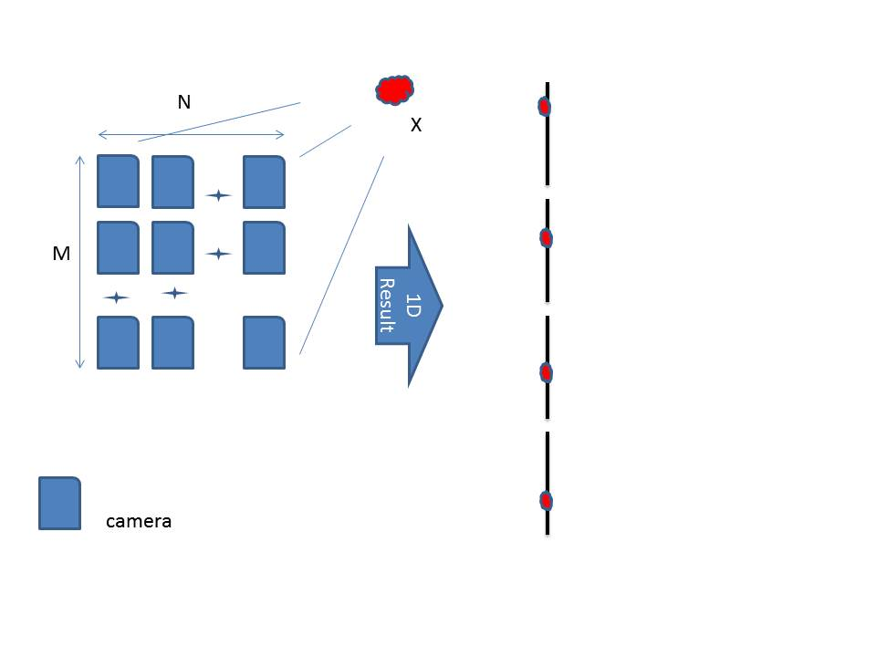
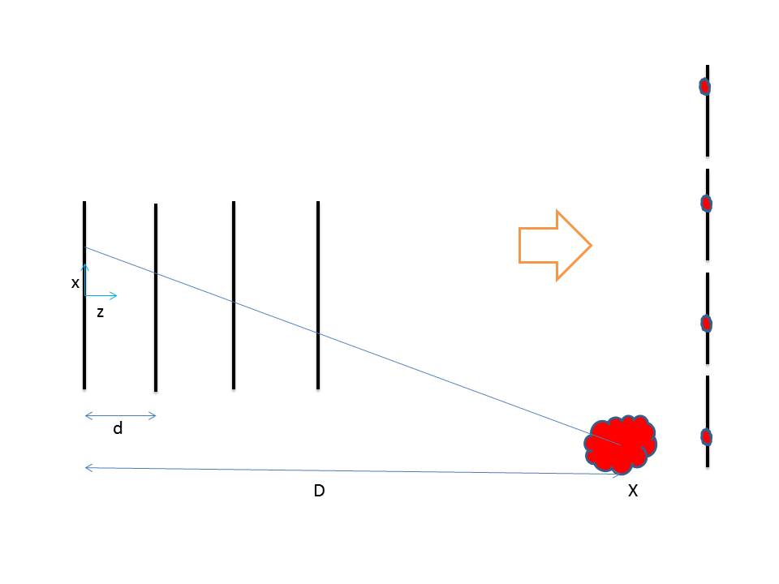
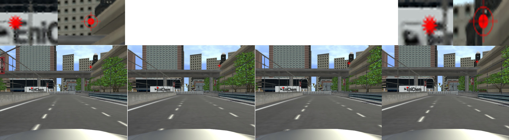

Note: For best view of equations use "GitHub with MathJax" extention for your browser.

# FeatureTrackingForAutonomousVehicle
Sequential frame feature tracking for autonomous vehicle

### Introduction

This method helps feature detection algorithm. The Extended formula shows that changing vehicle's speed can help to track feature in some region in the image. Now, this solution uses for stereo tracking, but in our framework, we can apply vehicle speed with a sequence of any frames which taken from the moving vehicle. An autonomous car is our goal which this type of motion can be applied.

We can apply this method in many sections of computer vision. In this subsection, we introduce how this model uses and how we can apply this algorithm.

An array camera [2] and image formation of it shown in figure 1. In this situation shows that when an object such X, place on image, the images of objects in this array as shown in right of picture is periodic.   

* figure 1: One sample of camera array and image formation*

Now, if a sequence of camera images form an object formed. what is the relation of image position and object position?
In figure 2 a camera move with constant speed. The images from object X form on any of camera sequence. In simple assumption we thick of constant speed but we proof the general case with different velocity. This paper proof a theory witch relate the difference in feature position in subsequent images. 

*figure 2:Camera in motion image formation*

*figure 3 : Feature detection in sequence of image*

####Difference between array of cameras and sequence of a camera in space

The extracted formula has major difference with array of cameras. One of difference of these methods are final formula. In array one The output relay on just depth. any feature with same depth has a periodic number, but in our case the output based on the depth and initial position of feature. Because of this difference the first has big impact on optical imaging but the later could not solve in optical imaging. The second difference is the array of flat can be implemented with many cameras on chip or any surface, but our case just happen when a camera penetrate in space. The implementation of sequence of camera is not reported yet.

### Applications

1. #### Object depth estimation

The formula in this method can be solved for scale estimation. For example, knowing the speed of the vehicle and three sequences of the frame from it, get the scale factor. This scale shows the object which the features relate to that in a depth of Alfa proportion to camera frame distance.

2. #### Warning system for autonomous car object on-road detection

3. #### Feature tracking accelerator
This algorithm shows that, when a camera penetrate in a world with fix, speed and there is no barrier in the road, then distance of features in two frame most be equal. This algorithm says that we can find a feature within a frames with a search within determining steps.

4. #### Classification of forward motion and unknown motion

5. #### Scale estimation in vision section
Known method in vision solves the problem up to scale. Method like 8-point algorithm just solve up to scale. In that paper The author introduces a section which helps others to solve the scale with other sensors or assumptions. Our introduced method solves this problem with knowing the speed. Speed is a simple parameter used in autonomous car.

6. #### Sub-pixel matching improvement
Many geometric equations in computer vision rely on the noise of features position in images. For instance, mankind can match two images with the precision of one pixel, but some algorithm like sift\cite{sift} present sub-pixel matching. In many conditions, some edges in image blurred and determining the position of the corner is not straight forward. Our algorithm can be used in feature tracking where some corner of consequence frame is occluded.

### Equation

#### General Equation

In this paper we used equation P as a point with depth of D

$$
P = \begin{pmatrix} X \\ Y\\ D \end{pmatrix}
$$
For the point on sequence of images, write such equation:
$$
		p_{0} = \begin{pmatrix}  \frac{X}{D} \\ \frac{Y}{D}  \end{pmatrix}
		,p_{1} = \begin{pmatrix}  \frac{X}{D+d} \\ \frac{Y}{D+d}  \end{pmatrix}
		,...
		,p_{n} = \begin{pmatrix}  \frac{X}{D+nd} \\ \frac{Y}{D+nd}  \end{pmatrix}
$$

If $D>>nd$ or the distance of camera zero to N should be small about the total depth of blocks in Images, then we can write:

$$
		with \\
	  p_{n} = \begin{pmatrix}  \frac{X}{D}*\frac{1}{(1+ \frac{nd}{D})} \\ 
										 \frac{Y}{D}*\frac{1}{(1+ \frac{nd}{D})}  \end{pmatrix}
	 ,p_{n} = \begin{pmatrix}  \frac{X}{D}* (1+ \frac{nd}{D})  ^{-1} \\ 
											\frac{Y}{D}* (1+ \frac{nd}{D})  ^{-1}   \end{pmatrix}
$$

With Binomial approximation, we can rewrite the equation as follows:

$$
		\approx
		 p_{n} = \begin{pmatrix}  \frac{X}{D}* (1- \frac{nd}{D})  \\ 
												\frac{Y}{D}* (1- \frac{nd}{D})   \end{pmatrix}
		=\begin{pmatrix}   p_{0x}*(1- \frac{nd}{D})  \\ 
							p_{0y}*(1- \frac{nd}{D})   \end{pmatrix}
$$

In last step, the equation shows that difference in two feature's position should be constant and equal to the $p_{0y} \frac{d}{D}$.

$$
\approx
		p_{nx}-p_{(n+1)x} = p_{0x}*(1- \frac{nd}{D}) - p_{0x}*(1- \frac{nd}{D} -  \frac{d}{D})
		=  p_{0x} \frac{d}{D}
$$

$$
\approx
		p_{ny}-p_{(n+1)y} = 
		=  p_{0y} \frac{d}{D}
$$

####  Extended method

In this section, generalized view of algorithm shown. When the camera penetrate with variable speed in this condition distance of two subsequent frame is not equal. In equation Ex_elementary has shown a basic formula of the variable distance between cameras.

$$
p_{0}  = \begin{pmatrix} \frac{X}{D} \\ \frac{Y}{D}  \end{pmatrix}
		,p_{1} = \begin{pmatrix}  \frac{X}{D+d_{1}} \\ \frac{Y}{D+d_{1}}  \end{pmatrix}
		,p_{2} = \begin{pmatrix}  \frac{X}{D+d_{1}+d_{2}} \\ \frac{Y}{D+d_{1}+d_{2}}  \end{pmatrix}
$$
*Ex_elementary*

Using Binomial approximation, same as equation Binomial approximation we this equation  for variable speed cameras.

$$
p_{1} \approx \begin{pmatrix}  \frac{X}{D}* (1- \frac{d_{1}}{D})  \\ 
												\frac{Y}{D}* (1- \frac{d_{1}}{D})   \end{pmatrix}
		,p_{2} \approx \begin{pmatrix}  \frac{X}{D}* (1- \frac{d_{1}+d_{2}}{D})  \\ 
												\frac{Y}{D}* (1- \frac{d_{1}+d_{2}}{D})   \end{pmatrix}
$$

Proportion of difference in two consequence is shown in equation Eq_final. This shows the proportion is constant for this condition. For any point in space, this equation uses the relative depth of that point.

$$
\frac{ p_{0}-p_{2} }{  p_{0}-p_{1} }= \frac{d_{1}+d_{2}}{d1}
$$

*Eq_final*

#### Equation when calibration present

$$
P=\begin{pmatrix} X \\ Y \\ D \end{pmatrix}
		, K = \begin{pmatrix}
		 f_{x} & \theta & O_{x} \\ 
		0      & f_{y}    & O_{y} \\ 
		0      & 0        & 1 \\ 
		 \end{pmatrix}
$$

$$
p_{nx}-p_{(n+1)x} =  (p_{0x}-O_{x}) \frac{d}{D}
$$

### Result

####  Problems

Synthetic dataset generator, help to check the algorithm. in this paper we use Vladimir Haltakov dataset generator[1]. We compare the difference for features in two consecutive frames.   
For first feature we have:

| x    | 298  | 296  | 294  | 291  |
| ---- | ---- | ---- | ---- | ---- |
| y    | 205  | 204  | 202  | 201  |

For second feature we have:

| x    | 465  | 463  | 470  | 478  |
| ---- | ---- | ---- | ---- | ---- |
| y    | 110  | 102  | 93   | 85   |

For third feature we have:

| x    | 159  | 149  | 139  | 128  |
| ---- | ---- | ---- | ---- | ---- |
| y    | 216  | 216  | 214  | 213  |

When camera frame rate is high enough, the frame are taken with centimeter or millimeter in location. In this configuration we know every cars dashboard and head rig is one meter long, this shows that this algorithm is good for many situation where the vehicle travel. In some condition where the camera has been placed on front light we has problem with depth of point in front of camera can generate violation in algorithm.
the bad point in images are like in picture $18_00007$ where the line of road is near the camera.

| x    | 217  | 211  | 204  | 190  |
| ---- | ---- | ---- | ---- | ---- |
| y    | 370  | 373  | 375  | 384  |

Test sample.

### Reference

[1] Vladimir Haltakov, Christian Unger, and Slobodan Ilic. ?Framework for generation of synthetic
ground truth data for driver assistance applications?. In: GCPR. 2013.

[2] Ren Ng et al. ?Light ?eld photography with a hand-held plenoptic camera?. In: Computer Science
Technical Report CSTR 2.11 (2005), pp. 1?11.
